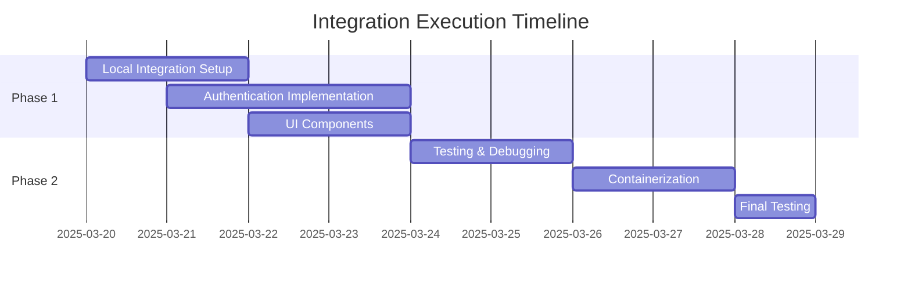

# Canvas Editor & Open WebUI Integration - Execution Plan

## Overview

This document outlines the execution plan for integrating Canvas Editor with Open WebUI, based on the detailed plans we've developed. We've prepared three key documents:

1. **sintonia-improved.md** - Comprehensive integration plan with Docker containerization
2. **color-palette.md** - Shared styling for visual consistency
3. **implementation-steps.md** - Step-by-step local testing procedures

## Execution Strategy

## Implementation Phases

### Phase 1: Local Development & Testing

1. **Shared Integration Setup** (Day 1)
   - Create integration directory
   - Add configuration files
   - Implement auth helpers

2. **Authentication Flow** (Days 1-3)
   - Implement API endpoints in Open WebUI
   - Create auth handling in Canvas Editor
   - Set up token exchange

3. **UI Components** (Days 2-3)
   - Add Editor button to Open WebUI
   - Create Return button in Canvas Editor
   - Apply shared styling

### Phase 2: Containerization & Production Readiness

4. **Dockerization** (Days 4-5)
   - Create Dockerfiles
   - Set up Docker Compose
   - Configure networking

5. **Final Testing** (Days 5-6)
   - Test in containerized environment
   - Verify error handling
   - Performance testing

## Key Implementation Challenges

| Challenge | Mitigation Strategy |
|-----------|---------------------|
| Authentication token security | Implement proper JWT handling with expiration |
| Cross-application navigation | Use POST forms with CSRF protection |
| Error handling | Add robust fallbacks and user-friendly messaging |
| Shared styling | Use the common color palette in both applications |
| Container networking | Configure proper Docker networks and test connectivity |

## Canvas Editor-Specific Considerations

1. Canvas Editor is primarily a library, so we need to implement authentication in the demo application
2. We need to identify proper insertion points for the Return button in the Canvas Editor UI
3. The editor needs to handle the authentication context during document operations

## Code Implementation Plan

1. Start with creating the shared integration directory and files
2. Implement the authentication endpoints in Open WebUI
3. Create the authentication handling in Canvas Editor
4. Add the UI components for navigation
5. Test the integration locally
6. Proceed to containerization once local testing is successful

## Next Steps

1. Switch to Code mode to begin implementation
2. Start with creating the shared integration files
3. Implement the authentication endpoints
4. Add the UI components
5. Test the integration

## Success Criteria

The integration will be considered successful when:

1. Users can navigate from Open WebUI to Canvas Editor with authentication preserved
2. Users can return from Canvas Editor to Open WebUI with their session intact
3. The integration handles error cases gracefully
4. The UI components maintain visual consistency between applications
5. The containerized deployment works reliably