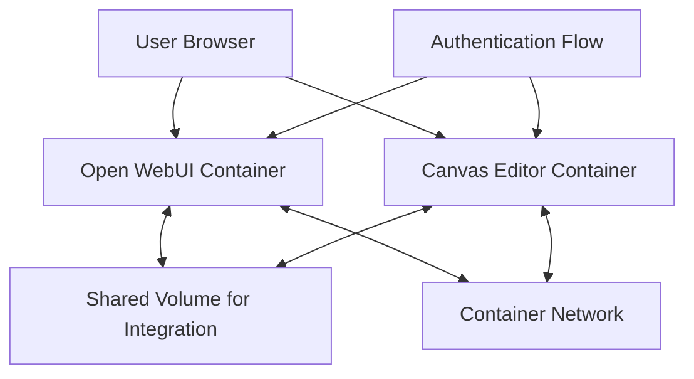
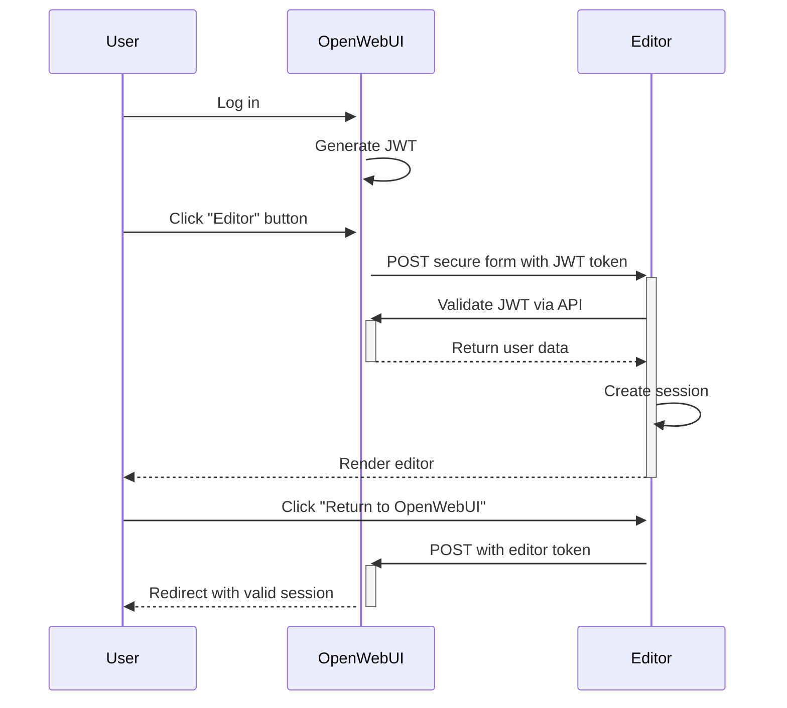

# Improved Integration Plan for Canvas Editor & Open WebUI

## Overview
This plan outlines the integration of Canvas Editor with Open WebUI in a containerized environment, ensuring robust communication and authentication between the two services.



## 1. Container Architecture

### Docker Compose Setup

```yaml
version: '3.8'

services:
  openwebui:
    image: openwebui:latest
    container_name: openwebui
    volumes:
      - ./integration:/app/integration
    ports:
      - "8080:8080"
    environment:
      - JWT_SECRET=your_secure_jwt_secret
      - EDITOR_SERVICE_URL=http://editor:3000
    networks:
      - app-network

  editor:
    image: canvas-editor:latest
    container_name: editor
    volumes:
      - ./integration:/app/integration
    ports:
      - "3000:3000"
    environment:
      - OPENWEBUI_SERVICE_URL=http://openwebui:8080
    networks:
      - app-network

volumes:
  integration:

networks:
  app-network:
    driver: bridge
```

### Key Improvements:
- **Shared Volume** replaces symlinks for integration files
- **Environment Variables** for service discovery
- **Network Configuration** for container-to-container communication

## 2. Shared Integration Directory

Instead of symlinks, create a shared volume structure:

```
integration/
├── auth-config.json       # Shared configuration
├── auth-helpers.js        # Shared utilities
└── environment.js         # Environment detection
```

### auth-config.json
```json
{
  "auth_endpoints": {
    "validate": "/api/v1/auth/validate",
    "return": "/api/v1/return"
  },
  "token_type": "JWT",
  "token_location": "localStorage",
  "token_key": "token",
  "shared_version": "1.0.0"
}
```

### environment.js
```javascript
/**
 * Environment detection for proper service URLs
 */
export function getServiceUrls() {
  return {
    openWebUIUrl: process.env.OPENWEBUI_SERVICE_URL || 'http://openwebui:8080',
    editorUrl: process.env.EDITOR_SERVICE_URL || 'http://editor:3000'
  };
}

export function isProduction() {
  return process.env.NODE_ENV === 'production';
}
```

### auth-helpers.js
```javascript
/**
 * Shared authentication helpers with improved error handling
 */
import { getServiceUrls } from './environment.js';

// Function to extract a token from localStorage with fallback
export function getTokenFromStorage(key = 'token') {
  try {
    if (typeof localStorage !== 'undefined') {
      return localStorage.getItem(key);
    }
  } catch (error) {
    console.error('LocalStorage access error:', error);
  }
  return null;
}

// Function to validate a token format with better error messaging
export function isValidTokenFormat(token) {
  if (!token) {
    console.warn('Token is empty or undefined');
    return false;
  }
  
  // JWT tokens have 3 parts separated by dots
  const parts = token.split('.');
  if (parts.length !== 3) {
    console.warn('Invalid token format: expected 3 parts separated by dots');
    return false;
  }
  
  return true;
}

// Function for token validation with timeout and retries
export async function validateToken(token, retries = 2) {
  const { openWebUIUrl } = getServiceUrls();
  let attempt = 0;
  
  while (attempt <= retries) {
    try {
      const controller = new AbortController();
      const timeoutId = setTimeout(() => controller.abort(), 5000);
      
      const response = await fetch(`${openWebUIUrl}/api/v1/auth/validate`, {
        headers: {
          'Authorization': `Bearer ${token}`
        },
        signal: controller.signal
      });
      
      clearTimeout(timeoutId);
      
      if (!response.ok) {
        const error = await response.json();
        throw new Error(error.detail || 'Token validation failed');
      }
      
      return await response.json();
    } catch (error) {
      console.error(`Token validation error (attempt ${attempt + 1}/${retries + 1}):`, error);
      
      if (error.name === 'AbortError') {
        console.warn('Request timed out, will retry');
      } else if (attempt >= retries) {
        throw error;
      }
      
      // Wait before retrying (exponential backoff)
      await new Promise(resolve => setTimeout(resolve, 1000 * Math.pow(2, attempt)));
      attempt++;
    }
  }
}
```

## 3. Authentication Flow



## 4. Open WebUI Implementation

### Authentication API Endpoint
```javascript
// src/routes/api/v1/auth/validate.js
import { corsHeaders } from '../../../utils/cors.js';

export async function GET({ request }) {
  // Enable CORS for cross-container requests
  if (request.method === 'OPTIONS') {
    return new Response(null, {
      headers: corsHeaders
    });
  }

  // Extract and validate token
  const authHeader = request.headers.get('Authorization');
  const token = authHeader?.replace('Bearer ', '');
  
  if (!token) {
    return new Response(JSON.stringify({ 
      detail: "No authentication credentials provided",
      error_code: "missing_token"
    }), {
      status: 401,
      headers: { 
        ...corsHeaders,
        'Content-Type': 'application/json' 
      }
    });
  }
  
  try {
    // Verify JWT with proper error handling
    const userData = await verifyJWT(token, process.env.JWT_SECRET);
    
    return new Response(JSON.stringify({
      id: userData.id,
      email: userData.email,
      name: userData.name,
      role: userData.role,
      permissions: userData.permissions,
      // Include timestamp for token freshness verification
      timestamp: new Date().toISOString()
    }), {
      status: 200,
      headers: { 
        ...corsHeaders,
        'Content-Type': 'application/json' 
      }
    });
  } catch (error) {
    console.error('Token validation error:', error.message);
    
    // Detailed error responses for different failure modes
    let status = 401;
    let detail = "Invalid authentication credentials";
    let error_code = "invalid_token";
    
    if (error.message === 'jwt expired') {
      detail = "Authentication token has expired";
      error_code = "token_expired";
    } else if (error.message.includes('malformed')) {
      detail = "Malformed authentication token";
      error_code = "malformed_token";
    }
    
    return new Response(JSON.stringify({ 
      detail,
      error_code
    }), {
      status,
      headers: { 
        ...corsHeaders,
        'Content-Type': 'application/json' 
      }
    });
  }
}

// CORS handling for preflight requests
export function OPTIONS() {
  return new Response(null, {
    headers: corsHeaders
  });
}
```

### Return Journey Endpoint
```javascript
// src/routes/api/v1/return/+server.js
import { corsHeaders } from '../../../utils/cors.js';

export async function POST({ request }) {
  try {
    // Get form data with fallbacks and validation
    const data = await request.formData();
    const editorToken = data.get('editor_token');
    const documentId = data.get('document_id');
    const returnPath = data.get('return_path') || '/';
    
    if (!editorToken) {
      console.warn('Missing editor token in return request');
      return new Response(null, {
        status: 303,
        headers: { 
          ...corsHeaders,
          'Location': '/login?error=missing_credentials' 
        }
      });
    }
    
    // Get the Editor service URL from environment
    const editorServiceUrl = process.env.EDITOR_SERVICE_URL || 'http://editor:3000';
    
    try {
      // Validate the editor token with timeout
      const controller = new AbortController();
      const timeoutId = setTimeout(() => controller.abort(), 5000);
      
      const response = await fetch(`${editorServiceUrl}/api/validate-return`, {
        method: 'POST',
        headers: { 
          'Content-Type': 'application/json',
          ...corsHeaders
        },
        body: JSON.stringify({ 
          token: editorToken,
          document_id: documentId
        }),
        signal: controller.signal
      });
      
      clearTimeout(timeoutId);
      
      if (response.ok) {
        const userData = await response.json();
        
        // Create a new OpenWebUI JWT
        const openWebUIToken = createJWT({
          id: userData.id,
          email: userData.email,
          name: userData.name,
          role: userData.role,
          permissions: userData.permissions
        });
        
        // Secure return with XSS protection
        const redirectHTML = `
          <!DOCTYPE html>
          <html>
            <head>
              <title>Returning to Open WebUI...</title>
              <meta http-equiv="Content-Security-Policy" content="default-src 'self'">
            </head>
            <body>
              <p>Returning to Open WebUI...</p>
              <script>
                // Store token securely
                localStorage.setItem('token', ${JSON.stringify(openWebUIToken)});
                // Use safe URL handling
                window.location.href = ${JSON.stringify(returnPath)};
              </script>
            </body>
          </html>
        `;
        
        return new Response(redirectHTML, {
          status: 200,
          headers: { 
            ...corsHeaders,
            'Content-Type': 'text/html',
            'X-Frame-Options': 'DENY'
          }
        });
      } else {
        // Handle validation failures with proper logging
        const errorData = await response.json();
        console.error('Return validation failed:', errorData.detail);
        
        return new Response(null, {
          status: 303,
          headers: { 
            ...corsHeaders,
            'Location': `/login?error=${encodeURIComponent(errorData.detail || 'invalid_return_token')}` 
          }
        });
      }
    } catch (error) {
      // Handle network errors and timeouts
      console.error('Return endpoint error:', error);
      let errorMessage = 'return_processing_error';
      
      if (error.name === 'AbortError') {
        errorMessage = 'editor_service_timeout';
        console.error('Editor service validation timed out');
      }
      
      return new Response(null, {
        status: 303,
        headers: { 
          ...corsHeaders,
          'Location': `/login?error=${errorMessage}` 
        }
      });
    }
  } catch (error) {
    // Handle unexpected errors
    console.error('Unexpected error in return endpoint:', error);
    
    return new Response(null, {
      status: 303,
      headers: { 
        ...corsHeaders,
        'Location': '/login?error=server_error' 
      }
    });
  }
}

// CORS handling for preflight requests
export function OPTIONS() {
  return new Response(null, {
    headers: corsHeaders
  });
}
```

### Editor Button Component
```svelte
<!-- src/lib/components/editor/EditorButton.svelte -->
<script>
  import { onMount } from 'svelte';
  import { user } from '$lib/stores/user';
  import { locale } from '$lib/stores/locale';
  import { createSecureFormSubmission, getTokenFromStorage, isValidTokenFormat } from '../../../integration/auth-helpers';
  import { getServiceUrls } from '../../../integration/environment';
  
  let editorServiceUrl = '';
  let isButtonDisabled = false;
  let errorMessage = '';
  
  onMount(() => {
    const urls = getServiceUrls();
    editorServiceUrl = urls.editorUrl;
  });
  
  // Function to open the editor with error handling
  async function openEditor() {
    errorMessage = '';
    isButtonDisabled = true;
    
    try {
      // Get the token from storage
      const token = getTokenFromStorage();
      
      if (!token) {
        errorMessage = 'Please log in to access the document editor';
        console.error('No authentication token found');
        isButtonDisabled = false;
        return;
      }
      
      if (!isValidTokenFormat(token)) {
        errorMessage = 'Invalid authentication token format';
        console.error('Invalid token format');
        isButtonDisabled = false;
        return;
      }
      
      // Create and submit a form to the editor
      const form = createSecureFormSubmission(`${editorServiceUrl}/auth`, token, {
        locale: $locale || 'en',
        return_path: window.location.pathname,
        context: JSON.stringify({
          user_id: $user?.id,
          theme: document.documentElement.getAttribute('data-theme') || 'light',
          timestamp: new Date().toISOString()
        })
      });
      
      // Add the form to the page and submit it
      document.body.appendChild(form);
      form.submit();
      document.body.removeChild(form);
      
      // Reset button after submission
      setTimeout(() => {
        isButtonDisabled = false;
      }, 1000);
    } catch (e) {
      console.error('Editor navigation error:', e);
      errorMessage = 'Error accessing the document editor';
      isButtonDisabled = false;
    }
  }
</script>

<button 
  class="flex items-center gap-2 px-3 py-2 mt-1 text-sm font-medium transition-colors duration-150 rounded-md hover:bg-gray-100 dark:hover:bg-gray-800 group"
  on:click={openEditor}
  aria-label="Open Document Editor"
  title="Create and edit documents"
  disabled={isButtonDisabled}
>
  <!-- The editor icon -->
  <svg class="w-5 h-5 text-gray-500 transition-colors duration-150 group-hover:text-primary-500 dark:text-gray-400 dark:group-hover:text-primary-400" xmlns="http://www.w3.org/2000/svg" viewBox="0 0 24 24" fill="none" stroke="currentColor" stroke-width="2" stroke-linecap="round" stroke-linejoin="round">
    <path d="M12 19l7-7 3 3-7 7-3-3z"></path>
    <path d="M18 13l-1.5-7.5L2 2l3.5 14.5L13 18l5-5z"></path>
    <path d="M2 2l7.586 7.586"></path>
    <path d="M11 11l4 4"></path>
  </svg>
  
  <!-- The button text -->
  <span class="transition-colors duration-150 group-hover:text-primary-500 dark:group-hover:text-primary-400">
    Document Editor
  </span>
  
  <!-- Notification badge if there are unread documents -->
  {#if $user?.unreadDocuments > 0}
    <span class="flex items-center justify-center w-5 h-5 text-xs font-bold text-white bg-primary-500 rounded-full">
      {$user.unreadDocuments > 99 ? '99+' : $user.unreadDocuments}
    </span>
  {/if}
</button>

<!-- Error message display -->
{#if errorMessage}
  <div class="mt-2 text-sm text-red-500" role="alert">
    {errorMessage}
  </div>
{/if}
```

## 5. Canvas Editor Implementation

### Authentication Endpoint
```svelte
<!-- src/routes/auth/+page.svelte -->
<script>
  import { onMount } from 'svelte';
  import { goto } from '$app/navigation';
  import { validateToken } from '../../integration/auth-helpers';
  import { getServiceUrls } from '../../integration/environment';
  
  let isLoading = true;
  let error = null;
  let retryCount = 0;
  const maxRetries = 3;
  
  async function processAuthentication() {
    try {
      // Get form data with validation
      const formData = new FormData(document.querySelector('form'));
      const token = formData.get('token');
      const locale = formData.get('locale') || 'en';
      const returnPath = formData.get('return_path') || '/';
      let context = {};
      
      try {
        context = formData.get('context') ? JSON.parse(formData.get('context')) : {};
      } catch (e) {
        console.error('Failed to parse context:', e);
      }
      
      if (!token) {
        error = "No authentication token provided";
        isLoading = false;
        return;
      }
      
      // Get service URLs from environment
      const { openWebUIUrl } = getServiceUrls();
      
      try {
        // Validate the token with OpenWebUI with retries
        const userData = await validateToken(token, 2);
        
        // Create our own session
        localStorage.setItem('editor_token', createEditorToken(userData));
        localStorage.setItem('editor_user', JSON.stringify(userData));
        localStorage.setItem('editor_locale', locale);
        localStorage.setItem('editor_return_path', returnPath);
        
        // Store any extra context
        if (Object.keys(context).length > 0) {
          localStorage.setItem('editor_context', JSON.stringify(context));
        }
        
        // Redirect to the editor
        isLoading = false;
        goto('/editor');
      } catch (validationError) {
        console.error('Token validation failed:', validationError);
        
        if (retryCount < maxRetries && validationError.name !== 'TypeError') {
          // Retry for network issues but not for invalid tokens
          retryCount++;
          await new Promise(resolve => setTimeout(resolve, 1000));
          return processAuthentication();
        }
        
        error = validationError.message || "Authentication failed";
        isLoading = false;
      }
    } catch (e) {
      console.error('Authentication processing error:', e);
      error = "An unexpected error occurred";
      isLoading = false;
    }
  }
  
  // Function to create an editor token with expiration
  function createEditorToken(userData) {
    // Create a token that expires in 1 hour
    const expiresAt = Date.now() + (60 * 60 * 1000);
    
    // In a real app, you would create a JWT here
    return `EDITOR_TOKEN_FOR_${userData.id}_${Date.now()}_EXP_${expiresAt}`;
  }
  
  onMount(() => {
    processAuthentication();
  });
</script>

<svelte:head>
  <title>Authenticating...</title>
</svelte:head>

<div class="auth-container">
  {#if isLoading}
    <div class="loading-box">
      <div class="spinner"></div>
      <p>Authenticating, please wait...</p>
      {#if retryCount > 0}
        <p class="retry-message">Retry attempt {retryCount}/{maxRetries}</p>
      {/if}
    </div>
  {:else if error}
    <div class="error-box">
      <h2>Authentication Error</h2>
      <p>{error}</p>
      <button 
        class="retry-button" 
        on:click={() => {
          const { openWebUIUrl } = getServiceUrls();
          window.location.href = openWebUIUrl;
        }}
      >
        Return to Open WebUI
      </button>
    </div>
  {/if}
</div>

<style>
  .auth-container {
    display: flex;
    justify-content: center;
    align-items: center;
    min-height: 100vh;
    background-color: #f8f9fa;
  }
  
  .loading-box, .error-box {
    background-color: white;
    border-radius: 8px;
    box-shadow: 0 4px 12px rgba(0, 0, 0, 0.1);
    padding: 2rem;
    text-align: center;
    max-width: 400px;
  }
  
  .spinner {
    border: 4px solid rgba(0, 0, 0, 0.1);
    border-radius: 50%;
    border-top: 4px solid #3498db;
    width: 40px;
    height: 40px;
    animation: spin 1s linear infinite;
    margin: 0 auto 1rem auto;
  }
  
  .retry-message {
    font-size: 0.8rem;
    color: #777;
    margin-top: 0.5rem;
  }
  
  @keyframes spin {
    0% { transform: rotate(0deg); }
    100% { transform: rotate(360deg); }
  }
  
  h2 {
    color: #e63946;
    margin-bottom: 1rem;
  }
  
  p {
    color: #555;
    margin-bottom: 1.5rem;
  }
  
  .retry-button {
    background-color: #457b9d;
    color: white;
    border: none;
    padding: 0.75rem 1.5rem;
    border-radius: 4px;
    font-size: 1rem;
    cursor: pointer;
    transition: background-color 0.2s;
  }
  
  .retry-button:hover {
    background-color: #1d3557;
  }
</style>
```

### Return Validation Endpoint
```javascript
// src/api/validate-return/+server.js
export async function POST({ request }) {
  try {
    // Get the token from the request with validation
    const requestData = await request.json().catch(() => ({}));
    const { token, document_id } = requestData;
    
    if (!token) {
      return new Response(JSON.stringify({ 
        detail: "No token provided",
        error_code: "missing_token"
      }), {
        status: 400,
        headers: { 'Content-Type': 'application/json' }
      });
    }
    
    // Validate the token with expiration check
    const tokenInfo = parseEditorToken(token);
    
    if (!tokenInfo.isValid) {
      return new Response(JSON.stringify({ 
        detail: tokenInfo.error || "Invalid token",
        error_code: "invalid_token"
      }), {
        status: 401,
        headers: { 'Content-Type': 'application/json' }
      });
    }
    
    // Check token expiration
    if (tokenInfo.isExpired) {
      return new Response(JSON.stringify({ 
        detail: "Token has expired",
        error_code: "token_expired"
      }), {
        status: 401,
        headers: { 'Content-Type': 'application/json' }
      });
    }
    
    // Get the user data
    const userData = await getUserData(tokenInfo.userId);
    
    if (!userData) {
      return new Response(JSON.stringify({ 
        detail: "User not found",
        error_code: "user_not_found"
      }), {
        status: 401,
        headers: { 'Content-Type': 'application/json' }
      });
    }
    
    // Return the user data
    return new Response(JSON.stringify({
      id: userData.id,
      email: userData.email,
      name: userData.name,
      role: userData.role,
      permissions: userData.permissions
    }), {
      status: 200,
      headers: { 'Content-Type': 'application/json' }
    });
  } catch (error) {
    console.error('Return validation error:', error);
    
    return new Response(JSON.stringify({ 
      detail: "Server error",
      error_code: "server_error"
    }), {
      status: 500,
      headers: { 'Content-Type': 'application/json' }
    });
  }
}

// Helper function to extract user ID and validate token
function parseEditorToken(token) {
  // Default response
  const response = {
    isValid: false,
    isExpired: false,
    userId: null,
    error: "Invalid token format"
  };
  
  try {
    // Parse our placeholder token format
    // EDITOR_TOKEN_FOR_[userId]_[timestamp]_EXP_[expirationTime]
    const match = token.match(/EDITOR_TOKEN_FOR_([a-zA-Z0-9]+)_(\d+)_EXP_(\d+)/);
    
    if (!match) {
      return response;
    }
    
    const userId = match[1];
    const timestamp = parseInt(match[2], 10);
    const expirationTime = parseInt(match[3], 10);
    const currentTime = Date.now();
    
    return {
      isValid: true,
      isExpired: currentTime > expirationTime,
      userId,
      timestamp,
      expirationTime,
      error: null
    };
  } catch (error) {
    console.error('Token parsing error:', error);
    response.error = "Token parsing error";
    return response;
  }
}

// Helper function to get user data
async function getUserData(userId) {
  // In a real app, you would get this from your database
  // For now, we'll just return a placeholder
  return {
    id: userId,
    email: `user_${userId}@example.com`,
    name: `User ${userId}`,
    role: 'user',
    permissions: {}
  };
}
```

### Return Button Component
```svelte
<!-- src/lib/components/navigation/ReturnButton.svelte -->
<script>
  import { onMount } from 'svelte';
  import { getServiceUrls } from '../../../integration/environment';
  
  let returnPath = '/';
  let openWebUIUrl = '';
  let isButtonDisabled = false;
  
  // Function to return to Open WebUI
  function returnToOpenWebUI() {
    if (isButtonDisabled) return;
    isButtonDisabled = true;
    
    try {
      // Get the editor token and other data
      const editorToken = localStorage.getItem('editor_token');
      const returnPath = localStorage.getItem('editor_return_path') || '/';
      
      if (!editorToken) {
        // Fallback if no token is found
        window.location.href = openWebUIUrl;
        return;
      }
      
      // Create a form with CSRF protection
      const csrfToken = generateRandomString(32);
      localStorage.setItem('editor_csrf_token', csrfToken);
      
      const form = document.createElement('form');
      form.method = 'POST';
      form.action = `${openWebUIUrl}/api/v1/return`;
      
      // Add the token
      const tokenInput = document.createElement('input');
      tokenInput.type = 'hidden';
      tokenInput.name = 'editor_token';
      tokenInput.value = editorToken;
      form.appendChild(tokenInput);
      
      // Add the CSRF token
      const csrfInput = document.createElement('input');
      csrfInput.type = 'hidden';
      csrfInput.name = 'csrf_token';
      csrfInput.value = csrfToken;
      form.appendChild(csrfInput);
      
      // Add the return path
      const returnPathInput = document.createElement('input');
      returnPathInput.type = 'hidden';
      returnPathInput.name = 'return_path';
      returnPathInput.value = returnPath;
      form.appendChild(returnPathInput);
      
      // Add the current document ID if there is one
      const documentId = getCurrentDocumentId();
      if (documentId) {
        const documentIdInput = document.createElement('input');
        documentIdInput.type = 'hidden';
        documentIdInput.name = 'document_id';
        documentIdInput.value = documentId;
        form.appendChild(documentIdInput);
      }
      
      // Submit the form
      document.body.appendChild(form);
      form.submit();
      document.body.removeChild(form);
      
      // Reset button after a timeout
      setTimeout(() => {
        isButtonDisabled = false;
      }, 2000);
    } catch (error) {
      console.error('Return navigation error:', error);
      // Fallback to direct navigation on error
      window.location.href = openWebUIUrl;
    }
  }
  
  // Helper function to get the current document ID
  function getCurrentDocumentId() {
    // In a real app, you would get this from your state
    return 'current-document-123';
  }
  
  // Helper function to generate a random string for CSRF
  function generateRandomString(length) {
    const characters = 'ABCDEFGHIJKLMNOPQRSTUVWXYZabcdefghijklmnopqrstuvwxyz0123456789';
    let result = '';
    for (let i = 0; i < length; i++) {
      result += characters.charAt(Math.floor(Math.random() * characters.length));
    }
    return result;
  }
  
  // Initialize variables when component mounts
  onMount(() => {
    returnPath = localStorage.getItem('editor_return_path') || '/';
    const urls = getServiceUrls();
    openWebUIUrl = urls.openWebUIUrl;
  });
</script>

<button 
  class="return-button" 
  on:click={returnToOpenWebUI}
  aria-label="Return to Open WebUI"
  title="Return to Open WebUI"
  disabled={isButtonDisabled}
>
  <svg class="return-icon" xmlns="http://www.w3.org/2000/svg" viewBox="0 0 24 24" fill="none" stroke="currentColor" stroke-width="2" stroke-linecap="round" stroke-linejoin="round">
    <path d="M19 12H5M12 19l-7-7 7-7"/>
  </svg>
  <span>Return to Open WebUI</span>
</button>

<style>
  .return-button {
    display: flex;
    align-items: center;
    gap: 0.5rem;
    padding: 0.5rem 1rem;
    background-color: #f1f5f9;
    color: #475569;
    border: none;
    border-radius: 0.375rem;
    font-size: 0.875rem;
    font-weight: 500;
    cursor: pointer;
    transition: background-color 0.15s, color 0.15s;
  }
  
  .return-button:hover:not([disabled]) {
    background-color: #e2e8f0;
    color: #334155;
  }
  
  .return-button:disabled {
    opacity: 0.6;
    cursor: not-allowed;
  }
  
  .return-icon {
    width: 1rem;
    height: 1rem;
  }
</style>
```

## 6. CORS Utility

```javascript
// src/utils/cors.js
// Define CORS headers to allow cross-container communication
export const corsHeaders = {
  'Access-Control-Allow-Origin': '*',
  'Access-Control-Allow-Methods': 'GET, POST, OPTIONS',
  'Access-Control-Allow-Headers': 'Content-Type, Authorization',
  'Access-Control-Max-Age': '86400', // 24 hours
};
```

## 7. Deployment and Testing

### Container Startup Sequence

1. Start both containers with Docker Compose:
   ```bash
   docker-compose up -d
   ```

2. Verify container network communication:
   ```bash
   docker exec openwebui ping -c 2 editor
   docker exec editor ping -c 2 openwebui
   ```

3. Test authentication endpoints:
   ```bash
   # Test OpenWebUI validation endpoint
   curl -X GET http://localhost:8080/api/v1/auth/validate \
     -H "Authorization: Bearer test_token" \
     -i

   # Test Editor return validation
   curl -X POST http://localhost:3000/api/validate-return \
     -H "Content-Type: application/json" \
     -d '{"token":"EDITOR_TOKEN_FOR_user123_1679000000000_EXP_1679003600000"}' \
     -i
   ```

### Troubleshooting Common Issues

| Issue | Solution |
|-------|----------|
| Container cannot resolve hostnames | Check Docker network settings, ensure both containers are on the same network |
| CORS errors | Verify the CORS headers are properly set in all API endpoints |
| Authentication failures | Check JWT secret consistency, token format, and validation logic |
| Missing environment variables | Ensure all required env vars are set in the Docker Compose file |
| Connection timeouts | Increase timeout values, implement retry logic, check network rules |
| File permissions in shared volume | Set appropriate permissions in Dockerfile or entrypoint script |

## 8. Security Considerations

1. **Token Security**:
   - Use strong JWT secrets
   - Implement short token lifetimes
   - Add token refresh mechanism
   - Store tokens securely (HttpOnly cookies when possible)

2. **CSRF Protection**:
   - Include CSRF tokens in all forms
   - Validate tokens on the server side
   - Use SameSite cookie attributes

3. **XSS Prevention**:
   - Escape user input
   - Implement Content Security Policy
   - Use JSON.stringify for JavaScript variables

4. **Network Security**:
   - Use encrypted connections (HTTPS)
   - Restrict container network access
   - Implement rate limiting

5. **Container Security**:
   - Run containers with minimal privileges
   - Use non-root users
   - Keep images updated
   - Scan for vulnerabilities

## 9. Scaling Considerations

1. **Stateless Authentication**:
   - Ensure authentication can work across multiple instances
   - Use a shared JWT secret or key management service

2. **Load Balancing**:
   - Configure load balancers for both services
   - Ensure sticky sessions if needed

3. **Monitoring**:
   - Add health check endpoints
   - Implement logging for authentication events
   - Set up alerting for authentication failures

## 10. Implementation Timeline

1. **Phase 1 (Day 1)**: Docker setup and networking configuration
   - Create Docker Compose file
   - Set up networks and volumes
   - Test basic connectivity

2. **Phase 2 (Day 1-2)**: Shared integration directory
   - Implement shared configuration files
   - Create environment detection
   - Test with both containers

3. **Phase 3 (Day 2-3)**: Authentication flow
   - Implement OpenWebUI validation endpoint
   - Create Editor authentication endpoint
   - Add return flow
   - Test token exchange

4. **Phase 4 (Day 3-4)**: UI components
   - Add Editor button to OpenWebUI
   - Create return button in Editor
   - Style and integrate components
   - Test user navigation

5. **Phase 5 (Day 4-5)**: Testing and error handling
   - Add comprehensive error handling
   - Implement retries and fallbacks
   - Test edge cases
   - Document troubleshooting steps